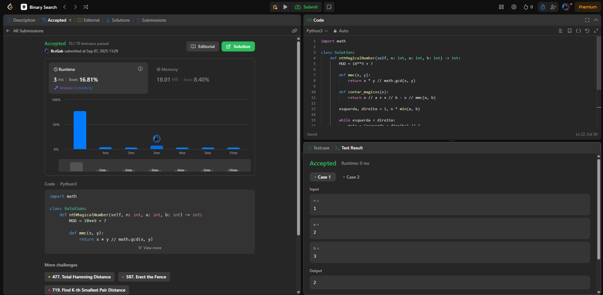
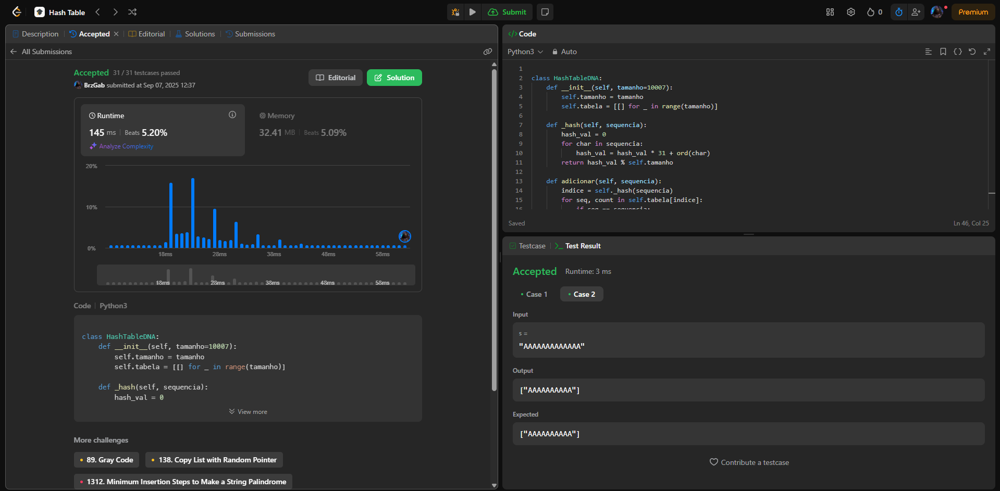
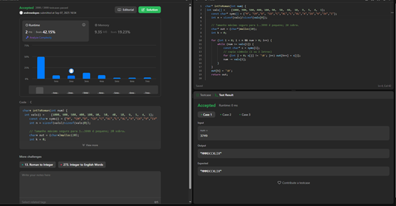
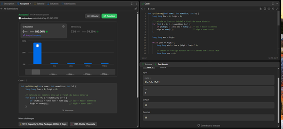

# Algoritmos de Busca - Trabalho 1 
## Alunos  
| Matrícula | Nome |  
|-----------------------|---------------------|  
| 23/1012129 | Gabriel Lopes de Amorim |  
| 21/1031593 | Andre Lopes de Sousa |  
## Descrição do projeto
Trabalho 1 - A dupla realizou a resolução de questões da plataforma [LeetCode](https://leetcode.com/problemset/) pelos integrantes do grupo com o objetivo de demonstrar e aplicar o conhecimento adquirido durante as aulas sobre (Algoritmos de Busca) da disciplina de Estrutura de Dados 2.
## Questões

|Questão | Dificuldade |
| -- | -- |
| [878. Nth Magical Number](https://leetcode.com/problems/nth-magical-number/description/?envType=problem-list-v2&envId=binary-search)| Difícil |
| [187. Repeated DNA Sequences](https://leetcode.com/problems/repeated-dna-sequences/description/)| Médio |
| [12. Integer to Roman](https://leetcode.com/problems/integer-to-roman/description/)| Médio|
| [410. Split Array Largest Sum](https://leetcode.com/problems/split-array-largest-sum/)| Difícil |

## Guia de instalação
Os Scripts Python utilizados para a resolução dos desafios estão na pasta Resolucoes.

## Capturas de tela
### [878. Nth Magical Number](https://leetcode.com/problems/nth-magical-number/description/?envType=problem-list-v2&envId=binary-search) 

Esse desafio consiste em encontrar o **N-ésimo número mágico**, onde um número é considerado "mágico" se for divisível por `a` ou `b`. O problema apresenta uma complexidade significativa devido ao tamanho potencial de N (até 10^9) e a necessidade de retornar o resultado módulo 10^9 + 7.

  

### [187. Repeated DNA Sequences](https://leetcode.com/problems/repeated-dna-sequences/description/)

Este desafio envolve identificar todas as **sequências de DNA de 10 letras** que aparecem mais de uma vez em uma string de DNA. O problema requer implementação eficiente de hash table para processar strings que podem ter até 10^5 caracteres, demonstrando aplicação prática de estruturas de dados em bioinformática.

  

### [12. Integer to Roman](https://leetcode.com/problems/integer-to-roman/description/)

O desafio consiste em decompor o número usando uma tabela de valores já com os casos subtrativos (IV, IX, XL, XC, CD, CM) de modo que, a cada passo, considera-se o maior valor ≤ num, concatena o símbolo e subtrai, repetindo até num == 0.

 

### [410. Split Array Largest Sum](https://leetcode.com/problems/split-array-largest-sum/)

O desafio consiste em dividir um array em k partes, minimizando o maior somatório. É um exemplo de binary search on answer em que não procuramos um índice, e sim o menor valor de resposta possível.

 

## Conclusões
### Para o **Desafio 878 - Nth Magical Number**:
O algoritmo de busca binária se mostrou extremamente eficiente para este problema, transformando uma solução que seria O(n) em força bruta (impraticável para n até 10^9) em uma solução O(log n). 

**Pontos Fortes:**
- Complexidade logarítmica permite resolver casos com N muito grande (até 10^9)
- Uso inteligente do Princípio da Inclusão-Exclusão para contar números eficientemente
- Solução elegante que evita gerar todos os números mágicos

**Limitações:**
- Requer compreensão do MMC e do Princípio da Inclusão-Exclusão
- A implementação precisa lidar com overflow potencial (por isso o módulo 10^9 + 7)
- Não é intuitiva de primeira vista, exigindo análise matemática do problema

Esta questão demonstra perfeitamente como a busca binária pode ser aplicada em problemas não-óbvios, onde não estamos buscando em um array, mas sim em um espaço matemático abstrato.

---

### Para o **Desafio 187 - Repeated DNA Sequences**:
A implementação manual de uma Hash Table demonstrou ser a abordagem ideal para identificar sequências repetidas de DNA. 

**Pontos Fortes:**
- Implementação completa de Hash Table com função hash polinomial
- Complexidade O(n) para processar toda a string de DNA
- Tratamento eficiente de colisões através de encadeamento (chaining)

**Limitações:**
- Uso de memória O(n) no pior caso (quando todas as subsequências são únicas)
- Função hash polinomial pode ter distribuição desigual para alguns padrões específicos
- Necessidade de percorrer toda a string, sem possibilidade de terminação antecipada

Este problema exemplifica a aplicação direta de Hash Tables em problemas reais de bioinformatica.

--- 
### Para o **Desafio 12 - Integer to Roman**:
O algoritmo implementado para conversão de inteiros para algarismos romanos demonstrou ser eficiente e elegante, com complexidade temporal O(1) devido ao conjunto limitado de valores possíveis (1-3999).

**Pontos Fortes:**
- Tabela pré-definida com casos subtrativos incluídos (IV, IX, XL, XC, CD, CM) evita lógica condicional complexa
- Algoritmo guloso sempre seleciona o maior valor possível, garantindo a forma canônica
- Código conciso e altamente legível com apenas dois loops aninhados
- Solução determinística que sempre produz o resultado correto (evita variações como "IIII" em vez de "IV")

**Limitações:**
- Restrito ao intervalo de 1 a 3999 conforme convenção romana padrão
- Não extensível facilmente para números maiores sem modificação da estrutura
- Dependente de tabela hardcoded, menos flexível para variações históricas dos numerais romanos

---

### Para o **Desafio 410 - Split Array Largest Sum**:
A solução utilizando busca binária sobre o espaço de respostas demonstrou ser a abordagem ótima para este problema de otimização combinatória, transformando um problema exponencial em uma solução O(n * log(sum - max)).

**Pontos Fortes:**
- Binary search on answer reduz drasticamente o espaço de busca
- Função de validação greedy em O(n) verifica viabilidade eficientemente
- Complexidade total O(n * log S) onde S é a soma do array, muito melhor que programação dinâmica O(n²k)
- Solução escalável para arrays grandes e valores elevados de k

**Limitações:**
- Não fornece a divisão ótima explicitamente, apenas o valor mínimo do maior somatório

## Apresentação
[Link para a apresentação](https://youtu.be/pAIV34M_N3o)

## Referências
- [Binary Search - GeeksforGeeks](https://www.geeksforgeeks.org/binary-search/)
- [Hash Table - Wikipedia](https://en.wikipedia.org/wiki/Hash_table)
- [Polynomial Rolling Hash](https://cp-algorithms.com/string/string-hashing.html)